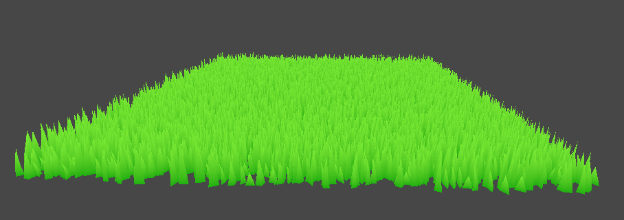

# Geometric Modeling & Shaders- Unity 3D

## Description

This GitHub repository contains the code for the laboratories carried out as part of my Geometric Modeling courses at ESIEE.

## Laboratories

Lab 1 : Procedural generation of three-dimensional geometric entities

Lab 2 : Catmull-Clark subdivision algorithm

Lab 3-a : Wave Tesselation

Lab 3-b : Level of Detail Tesselation

Lab 3-c : Working on new shader

Lab 3-d : Procedural grass and grass blade shader

Lab 4 : Moving Calculations in shader

[Watch Video](https://youtu.be/XpP3Ws0bVSU)

Lab 5-a : Animating fishes and butterflies

[Watch Video](https://youtu.be/Ll-AmPCW_dE)

Lab 5-b : Creating waves with vertex displacement

[Watch Video](https://youtu.be/wGiH_wfXyTA)

Lab 5-c : Blob-like deformation shader

Lab 5-d : Interactive map

Lab 5-e : Cyanilux's melting candle

[Watch Video](https://youtu.be/DNzvVhMdoJw)

Lab 6-a : URP geometry shader for grass (Zelda)

[Watch Video](https://youtu.be/F1Cl8Pdmh-0)

Lab 6-b : Geometry shader in URP

[Watch Video](https://youtu.be/PUioNGx8Z-Q)

Lab 6-c : Advanced rendering - flat and wireframe shading

Lab 6-d : Wireframe shader graph

Lab 6-e : Wireframe URP shader with primitive 3D spaceship

## Sea Project

Passionné par le jeu **Sea of Thieves**, j'ai entrepris de créer une scène immersive dans une ambiance pirate, intégrant des éléments aquatiques et des bateaux. Pour ce faire, j'ai développé plusieurs shaders spécifiques : SubWater Shader, WaterSurface Shader, DepthMask Shader, Wind Sail Shader et Procedural Wood Shader. Mon objectif était de capturer l'esthétique et la dynamique du monde marin tout en exploitant les capacités techniques de Unity et de ses outils associés pour créer des effets visuels réalistes et performants.

[Watch Video](https://youtu.be/Kf9NEJig0lg)

## Contributions

We welcome contributions to enhance the game's graphics, code, and overall functionality. Please submit your changes through GitHub by creating pull requests.

## Sources

[Doubly connected edge list](https://en.wikipedia.org/wiki/Doubly_connected_edge_list)

[CS184/284A: Articles](https://cs184.eecs.berkeley.edu/sp19/article/15/the-half-edge-data-structure)

[The Winged-Edge Data Structure](https://pages.mtu.edu/~shene/COURSES/cs3621/NOTES/model/winged-e.html)

[Winged edge](https://en.wikipedia.org/wiki/Winged_edge#:~:text=In)

[A Halfedge Refinement Rule for Parallel Catmull Clark Subdivision](https://www.youtube.com/watch?v=Ys2j5n9zWys)

[onrendering.com](https://onrendering.com/data/papers/catmark/HalfedgeCatmullClark.pdf)

[Catmull–Clark subdivision surface - Rosetta Code](https://rosettacode.org/wiki/Catmull–Clark_subdivision_surface)

[Repository Geometric Modeling ESIEE](https://github.com/AntoninJuquel/geometric-modeling-esiee)

[Unity Shader Graph Basics (Part 5 - Vertex Shaders)](https://www.youtube.com/watch?v=2KSLO9JnxHA&t=59s)

[[Unity3D] Intro to Geometry Shader](https://jayjingyuliu.wordpress.com/2018/01/24/unity3d-intro-to-geometry-shader/)

[Waves](https://catlikecoding.com/unity/tutorials/flow/waves/)

[Shader Graph: Vertex Displacement - Unity Learn](https://learn.unity.com/tutorial/shader-graph-vertex-displacement)

[Interactive Map Shader: Vertex Displacement - Alan Zucconi](https://www.alanzucconi.com/2019/07/03/interactive-map-01/)

[Interactive Map Shader: Scrolling Effect - Alan Zucconi](https://www.alanzucconi.com/2019/07/03/interactive-map-02/)

[Interactive Map Shader: Terrain Shading - Alan Zucconi](https://www.alanzucconi.com/2019/07/03/interactive-map-shader-terrain-shading/)

[Blender GIS](https://www.youtube.com/watch?v=YNtKnmRXVlo)

[Home | OpenTopography](https://opentopography.org/)

[Fire/Flame Shader Breakdown](https://www.cyanilux.com/tutorials/fire-shader-breakdown/)

[Cyan ✨ on Twitter / X](https://x.com/Cyanilux/status/1680308010831192070)

[Stylised Grass with Shaders in URP](https://danielilett.com/2021-08-24-tut5-17-stylised-grass/)

[Making Zelda: Breath of the Wild Stylised Grass in Unity URP](https://www.youtube.com/watch?v=MeyW_aYE82s)

[Repository - Daniel Ilett : A Legend of Zelda: Breath of the Wild-style grass shader](https://github.com/daniel-ilett/shaders-botw-grass)

[Geometry Shaders in URP - Game Dev Bill](https://gamedevbill.com/geometry-shaders-in-urp/)

[Geometry Shaders in URP - Plus how to create code shaders from shader graph](https://www.youtube.com/watch?v=beSRCSRS6mI)

[Flat and Wireframe Shading](https://catlikecoding.com/unity/tutorials/advanced-rendering/flat-and-wireframe-shading/)

[Repository WireframeShaderGraph](https://github.com/ArturoNereu/WireframeShaderGraph)
